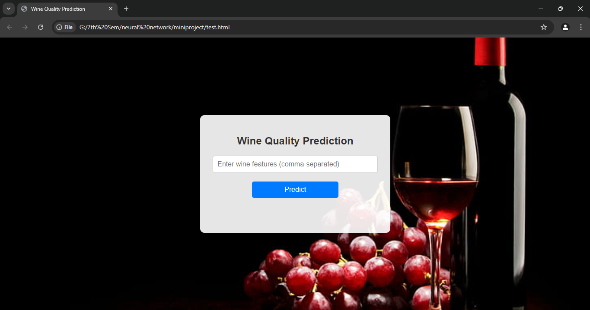

# Wine-Quality-Prediction

 ## Description
This project uses machine learning and deep learning models to predict the quality of wine based on its physicochemical properties. It includes a user-friendly **GUI built with Tkinter** and a **web interface** for predictions. The models were trained using the `Wine Quality Dataset` and achieve good accuracy in distinguishing between good and bad quality wine.

## Features
- Implements **Sequential Neural Network** for predictions.
- **Tkinter-based GUI** for local predictions.
- **Frontend web interface** for remote predictions (HTML/JavaScript).
- Normalization of input features for better model performance.
- Model evaluation with accuracy score and classification report.

## Technologies Used
- Python
  - NumPy
  - Pandas
  - scikit-learn
  - TensorFlow/Keras
- Tkinter for GUI
- HTML, CSS, JavaScript for Web Interface
- Git/GitHub for version control

